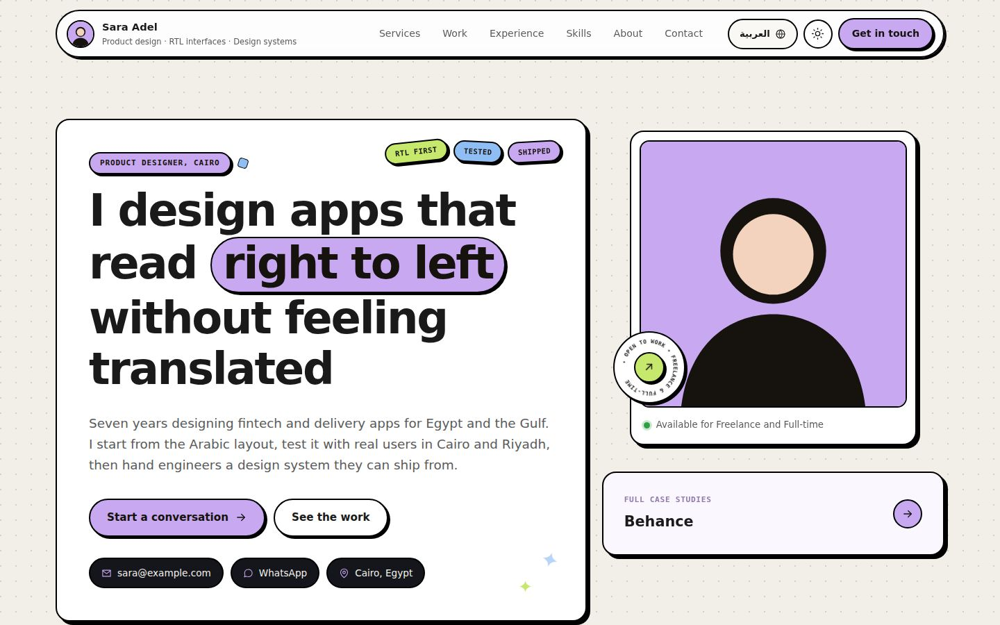
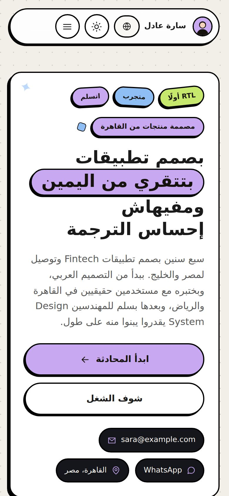
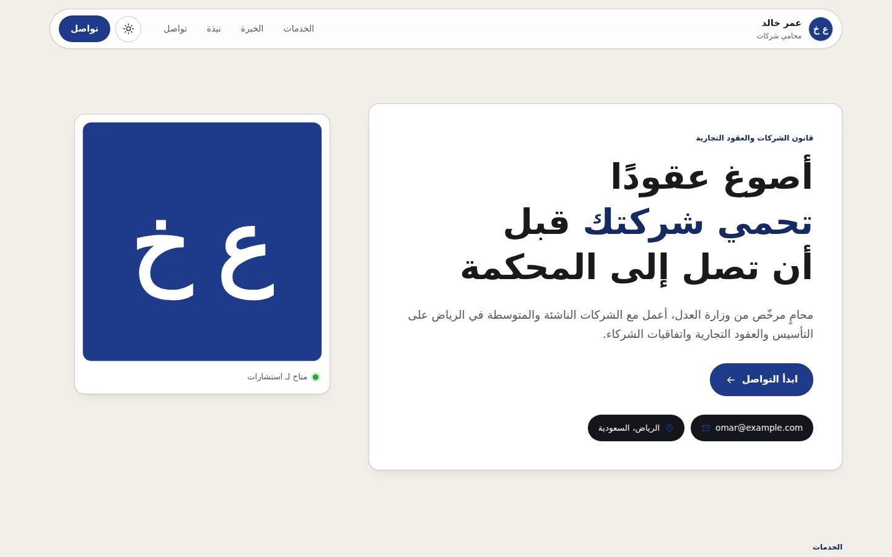
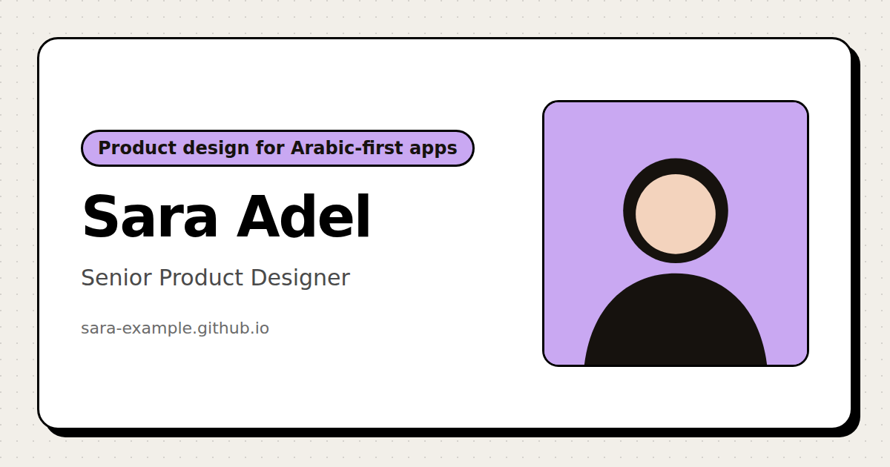
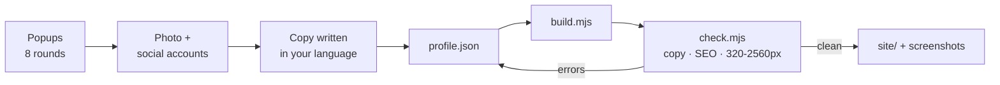

<div align="center">

# Portfolio Interview

**An agent skill that interviews you in a few popups, then builds your personal portfolio site: responsive, bilingual, and ready for search engines and AI answer engines.**

[English](#english) · [العربية](#العربية)



  

<sub>Built from the two example profiles in <code>evals/fixtures/</code>: a bilingual product designer, and a Riyadh lawyer in formal Arabic with the calm style.</sub>

</div>

---

## English

### What you get

You answer about eight rounds of multiple-choice popups. Every popup also accepts a typed answer. Along the way you add your photo and social accounts. The skill writes the copy, builds the site, checks it, and shows you screenshots before you publish.

| | |
|---|---|
| **Fits your field** | 12 field types (developer, designer, marketer, writer, creator, photographer, product, consultant, academic, educator, law/medicine/finance, other). Each one sets the section names, what proof comes first, the style and the colour. |
| **Arabic and English** | One language or both. The Arabic page is fully RTL, in Egyptian or formal Arabic depending on your audience. |
| **Responsive** | Checked with no horizontal scroll from 320 px to 2560 px, in light and dark mode. Every section still shows with JavaScript turned off. |
| **Search and AI answers** | Person, ProfilePage, ItemList and FAQPage JSON-LD, plus hreflang, canonical, Open Graph, `sitemap.xml` and `llms.txt`. `robots.txt` allows GPTBot, ClaudeBot and PerplexityBot. The build also renders a 1200×630 share card. |
| **No filler** | The build fails on invented-sounding copy (the "not just X, it's Y" formula, a list of buzzwords, em dashes), on numbers without a source, and on unnamed testimonials. |
| **Easy to host** | Plain HTML, CSS and a small script with no dependencies. The output works on GitHub Pages, Netlify, Vercel or any static host. |



### Install

Pick the tool you use. Each method below was tested as written.

<details open>
<summary><strong>Claude Code: plugin (recommended)</strong></summary>

Inside Claude Code:

```text
/plugin marketplace add imMamdouhaboammar/imMamdouhaboammar
/plugin install portfolio-interview@mamdouh-skills
```

Then start it with `/portfolio-interview:portfolio-interview`, or just say "build me a portfolio". To update later, run `/plugin marketplace update mamdouh-skills`.

</details>

<details>
<summary><strong>Claude Code and Codex: <code>npx skills</code></strong></summary>

```bash
# into the current project
npx skills add imMamdouhaboammar/imMamdouhaboammar --skill portfolio-interview

# for every project on this machine, Claude Code and Codex only, without prompts
npx skills add imMamdouhaboammar/imMamdouhaboammar --skill portfolio-interview -g -a claude-code -a codex -y
```

- **Claude Code:** start it with `/portfolio-interview`.
- **Codex:** start it with `$portfolio-interview`, or describe what you want and Codex picks it up.

</details>

<details>
<summary><strong>Claude Code: copy the folder</strong></summary>

```bash
git clone --depth 1 https://github.com/imMamdouhaboammar/imMamdouhaboammar.git /tmp/mamdouh
mkdir -p ~/.claude/skills
cp -R /tmp/mamdouh/.claude/skills/portfolio-interview ~/.claude/skills/
```

To install it for one project only, use `.claude/skills/` inside that project. Start it with `/portfolio-interview`.

</details>

<details>
<summary><strong>Codex: copy the folder</strong></summary>

```bash
git clone --depth 1 https://github.com/imMamdouhaboammar/imMamdouhaboammar.git /tmp/mamdouh
mkdir -p ~/.agents/skills
cp -R /tmp/mamdouh/.claude/skills/portfolio-interview ~/.agents/skills/
```

For one project only, copy it to `.agents/skills/` in the repository. Restart Codex if the skill doesn't appear.

</details>

<details>
<summary><strong>claude.ai (web and desktop): upload a ZIP</strong></summary>

1. Build the ZIP:
   ```bash
   git clone --depth 1 https://github.com/imMamdouhaboammar/imMamdouhaboammar.git /tmp/mamdouh
   node /tmp/mamdouh/.claude/skills/portfolio-interview/scripts/package.mjs ~/portfolio-interview.zip
   ```
   The same ZIP is attached to every run of the **Portfolio interview skill checks** workflow, under Actions → Artifacts (you need to be signed in to GitHub).
2. Turn on code execution: **Settings → Capabilities** (Team and Enterprise admins: **Organization settings → Plugins & skills**).
3. Go to **Customize → Skills → + → Create skill → Upload a skill** and choose the ZIP.
4. Start a chat and say "build me a portfolio".

On claude.ai the rounds appear as popups when the question widget is available. Otherwise they come as short numbered messages. The site is built in Claude's sandbox and handed to you as files.

</details>

### Requirements

- **Node.js 18 or newer.** Needed for the build and the checks.
- **Playwright with Chromium** (optional). Used for the share card and for the responsive and dark-mode checks. Without it, those steps are skipped with a warning and every other check still runs. To add it: `npm i -g playwright && npx playwright install chromium`.

### How it runs



| Round | Asks about |
|---|---|
| 1 Setup | Language, field, goal (clients, job, brand, academic), look, Arabic dialect |
| 2 Field | Specialty, years of experience, who hires you, markets |
| 3 Identity | Name and title (suggested from git or your CV), city, availability |
| 4 Proof | Where your work lives, numbers with sources, real testimonials |
| 5 Photo | File path, attachment or URL. With no photo, an initials monogram is used |
| 6 Socials | Professional and social accounts, turned into `sameAs` links |
| 7 Contact | Email, WhatsApp, hosting, colour |
| 8 Review | Headline, summary and meta description before anything is built |

The output lands in `./portfolio/` next to your `profile.json`:

```text
portfolio/
  profile.json          your answers, the single file you edit later
  avatar.jpg
  site/
    index.html          default language
    ar/index.html       second language, RTL
    assets/             css, js, avatar, og.png, work images
    robots.txt  sitemap.xml  llms.txt  site.webmanifest  404.html
```

### Running the scripts yourself

```bash
S=~/.claude/skills/portfolio-interview      # or wherever the skill is installed

node $S/scripts/build.mjs portfolio/profile.json --out portfolio/site --og
node $S/scripts/check.mjs portfolio/profile.json portfolio/site
node $S/scripts/selftest.mjs --browser       # the skill's own tests
node $S/scripts/package.mjs                  # ZIP for claude.ai
```

To change anything later, edit `profile.json` and rebuild. Don't edit the generated HTML: the next build overwrites it.

### Publishing

- **GitHub Pages:** push `site/` to a repository named `<user>.github.io`, and set `site.url` to `https://<user>.github.io/`.
- **Netlify or Vercel:** drag the `site/` folder into the dashboard. No build command is needed.
- **Your own domain:** set `site.url` to it, rebuild, then point DNS as your host explains.

After launch, add the site URL to every social profile's website field, and submit `sitemap.xml` in Google Search Console and Bing Webmaster Tools. Both steps help search engines and answer engines connect your accounts to one person. More in [`references/seo-geo.md`](references/seo-geo.md).

### Inside the folder

```text
SKILL.md                  the instructions the agent follows
references/
  interview.md            every popup round, as exact question payloads
  field-playbook.md       how each field changes the site
  profile-schema.md       the profile.json contract
  seo-geo.md              what the build emits, and post-launch steps
  copy-rules.md           the writing standard
scripts/                  build, check, selftest, package
assets/template/          site.css and site.js
agents/openai.yaml        Codex display metadata
evals/fixtures/           example profiles, including one built to fail
docs/                     the screenshots in this README
```

The design comes from the [portfolio page](https://immamdouhaboammar.github.io/imMamdouhaboammar/portfolio/) in this repository.

---

## العربية

<div dir="rtl">

### السكيل بيعمل إيه

بتجاوب على حوالي ثماني جولات Popups فيها اختيارات جاهزة، وكل سؤال فيه خانة تكتب فيها إجابتك لو مش لاقيها في الاختيارات. في النص بتضيف صورتك وحساباتك على السوشال. بعد كده السكيل بيكتب النصوص بلغتك، ويبني الموقع، ويراجعه، ويوريك صوره على الموبايل والديسكتوب قبل ما تنشره.

- **مناسب لمجالك:** فيه 12 نوع مجال، منهم المطوّر والمصمم والمسوّق والكاتب وصانع المحتوى والمصوّر والمحامي والدكتور. كل نوع بيحدد أسماء الأقسام، ونوع الإثبات اللي يظهر الأول، والستايل، واللون.
- **عربي وإنجليزي:** لغة واحدة أو الاتنين. الصفحة العربية RTL بالكامل، ولهجتها مصري أو فصحى حسب جمهورك.
- **بيشتغل على أي شاشة:** اتجرب من 320px لحد 2560px من غير Scroll بالعرض، في الوضع الفاتح والغامق، وبيظهر كامل حتى لو الـ JavaScript مقفول.
- **جاهز للبحث وأدوات الـ AI:** فيه Schema للشخص والصفحة والشغل والأسئلة الشائعة، وhreflang وSitemap و`llms.txt`، وملف `robots.txt` بيسمح لبوتات ChatGPT وClaude وPerplexity، وصورة مشاركة 1200×630 بتتعمل تلقائي.
- **من غير كلام محشو:** البناء بيقف لو النص فيه جمل النفي ثم الإثبات زي "ده مش X، ده Y" أو "مش مجرد"، أو كلمات مستهلكة، أو الـ em dash. وبيقف برضه لو فيه رقم ملوش مصدر، أو توصية من غير اسم صاحبها.

### التثبيت

جرّبت كل طريقة من دول بنفس الأوامر المكتوبة هنا.

**في Claude Code كـ Plugin (الأسهل):**

</div>

```text
/plugin marketplace add imMamdouhaboammar/imMamdouhaboammar
/plugin install portfolio-interview@mamdouh-skills
```

<div dir="rtl">

بعدها شغّله بـ `/portfolio-interview:portfolio-interview`، أو قول لـ Claude "اعملي بورتفوليو" وهو هيشغله لوحده.

**في Claude Code أو Codex بأداة `npx skills`:**

</div>

```bash
npx skills add imMamdouhaboammar/imMamdouhaboammar --skill portfolio-interview
```

<div dir="rtl">

في Claude Code شغّله بـ `/portfolio-interview`، وفي Codex بـ `$portfolio-interview`. ولو عايزه متاح في كل مشاريعك، زوّد `-g` على الأمر.

**نسخ الفولدر بإيدك:** انسخ فولدر `.claude/skills/portfolio-interview` من الريبو لواحد من الأماكن دي:

- `~/.claude/skills/` عشان Claude Code
- `~/.agents/skills/` عشان Codex

**على claude.ai:**

1. اعمل ملف ZIP بالأمر `node scripts/package.mjs`. أو نزّله جاهز من Artifacts آخر تشغيل لـ Workflow **Portfolio interview skill checks** في تبويب Actions على GitHub، ولازم تكون عامل تسجيل دخول.
2. شغّل Code execution من **Settings ← Capabilities**.
3. ارفع الملف من **Customize ← Skills ← + ← Create skill ← Upload a skill**.

### المتطلبات

- **Node.js 18 أو أحدث:** لازم عشان البناء والمراجعة.
- **Playwright (اختياري):** بيعمل صورة المشاركة، وبيراجع الموقع على الشاشات المختلفة وفي الوضع الغامق. لو مش متسطب، الخطوتين دول بيتخطوا مع تنبيه، وباقي المراجعة بتكمل عادي.

### بعد النشر

1. حط لينك الموقع في خانة Website في كل حساباتك على السوشال. ده بيخلي جوجل وأدوات الـ AI تعرف إن الموقع والحسابات دي كلها لنفس الشخص.
2. سجّل الموقع في Google Search Console وBing Webmaster Tools، وابعت ملف `sitemap.xml` في الاتنين.

ولو عايز تعدل أي حاجة بعد كده، عدّل `profile.json` وابني الموقع تاني. متعدلش في ملفات الـ HTML نفسها، لإن أول Build جديد هيمسح تعديلاتك.

</div>
