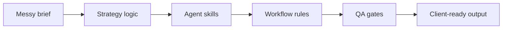

<!-- Profile README for imMamdouhaboammar -->

# Mamdouh Aboammar

### Digital Director · Ex-copywriter · Brand & Media Strategist · AI Agency Systems Builder

**I build the systems behind better marketing work:** briefs, paid media logic, conversion copy, AI agents, MCP tools, CLIs, documentation, and quality gates.

I am not trying to look like a pure software engineer. I am building a public technical layer around years of agency work, client pressure, messy briefs, campaign delivery, and AI-assisted production.

  
  
  
  
  

  
  
  
  
  
  

---

## Read me like this

Most profiles say what someone knows. I prefer showing how I think.

I come from marketing, content, paid media, CRO, UX writing, and brand strategy. My current work sits at the point where agency delivery meets AI systems: reusable skills, workflow rules, local memory, MCP tooling, frontend QA, and public playbooks.

> The useful part of AI is not the answer. It is the work system around the answer.

<table>
<tr>
<td width="20%" valign="top">

### Direction

AI agents, marketing systems, agent skills, documentation, and public tools.

</td>
<td width="20%" valign="top">

### Background

Paid media, conversion copy, content strategy, campaign architecture, and client delivery.

</td>
<td width="20%" valign="top">

### Product lab

PrePilot Agency Suite: structured AI workflows for real agency tasks.

</td>
<td width="20%" valign="top">

### Build style

Specs first. Clear rules. Review loops. Human judgment stays in the loop.

</td>
<td width="20%" valign="top">

### Markets

Egypt, Saudi Arabia, UAE, Qatar, and Canada.

</td>
</tr>
</table>

---

## What I build

| When the work looks like this | I build this |
|---|---|
| Messy client brief | Intake logic, strategy frames, and delivery checklists |
| Generic AI output | Agent skills, memory rules, and review loops |
| AI-built frontend slop | Preflight checks, QA gates, and repair lists |
| Repeated prompting | Reusable workflows, specs, and context packs |
| Marketing task with too many moving parts | Product-shaped systems that make the work easier to review |
| Team knowledge stuck in people’s heads | Playbooks, operating docs, and agent-ready instructions |

---

## Featured public projects

  
  

  
  

| Project | What it says about my work |
|---|---|
| [Riftbook](https://github.com/imMamdouhaboammar/Riftbook) | I care about making AI-assisted building easier to understand and repeat |
| [unslop-preflight](https://github.com/imMamdouhaboammar/unslop-preflight) | I treat frontend quality as a system, not a last-minute cleanup task |
| [agent-kernel](https://github.com/imMamdouhaboammar/agent-kernel) | I am exploring local rules, memory, and safer coding-agent behavior |
| [delegate-team](https://github.com/imMamdouhaboammar/delegate-team) | I think agent work should be routed by task type, not dumped into one chat |

---

## Product lab: PrePilot Agency Suite

**PrePilot Agency Suite** is where I turn real agency work into structured AI systems.

It is built around a simple belief: a useful AI assistant needs more than a prompt. It needs role context, work rules, intake questions, review logic, and output standards.

| Layer | What I am building |
|---|---|
| Agency skills | Structured skills for paid media, content, strategy, CRO, briefs, audits, and proposals |
| Workflow packs | Repeatable paths from brief to output, with checks at each step |
| MCP and connectors | Ways to connect AI tools to the workspace instead of keeping them isolated |
| Productized delivery | Clear packs, checklists, and outputs that small teams can actually use |
| Quality control | Guardrails for copy, design logic, tracking, links, specs, and client-facing polish |

---

## My working stack

  
  
  
  
  
  
  
  
  
  
  
  
  

| I use these for | Practical purpose |
|---|---|
| React, Vite, TypeScript | Product interfaces, dashboards, Chrome extension UI, and internal tools |
| Python, Node.js, CLI tools | Automation, local utilities, tooling experiments, and build scripts |
| MCP, FastMCP, connectors | Agent access to real tools and workspaces |
| Supabase, Google Cloud, GitHub Actions | Product backends, deployment paths, and release workflows |
| Markdown, docs, playbooks | Turning messy thinking into instructions other people and agents can follow |

---

## GitHub signal

  
  

  

---

## How I judge good work

| Principle | What it means in practice |
|---|---|
| Clarity before decoration | If the idea is unclear, design will not save it |
| Proof before claims | Say less, show the system, link the repo |
| Workflow before output | The process should be repeatable, not lucky |
| Context before code | A coding agent without project context will make expensive guesses |
| Review before shipping | AI can produce valid files that still create bad UX |
| Human judgment stays in the loop | The point is better work, not blind automation |

---

## Open source contribution roadmap

I am focusing my public contributions on projects where AI agents, agent skills, marketing workflows, documentation, and practical tooling meet.

[Read the full roadmap](./OPEN_SOURCE_ROADMAP.md)

| Target repo | Contribution angle |
|---|---|
| [500-AI-Agents-Projects](https://github.com/ashishpatel26/500-AI-Agents-Projects) | AI agent discovery, categorization, and practical use-case examples |
| [ai-agents-skills](https://github.com/hoodini/ai-agents-skills) | Agent skills for marketing, content, CRO, research, and campaign work |
| [Multi-Agent-Marketing-Course](https://github.com/The-Swarm-Corporation/Multi-Agent-Marketing-Course) | Multi-agent workflows for real marketing and agency operations |
| [ai-marketing-skills](https://github.com/ericosiu/ai-marketing-skills) | Structured marketing skills, prompt packs, and workflow examples |

---

## Connect

  
  
  

