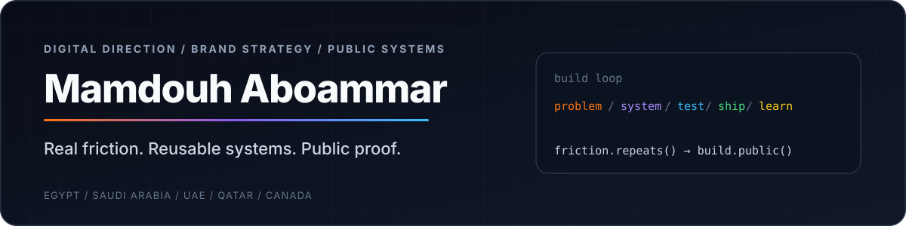

  

  <a href="https://www.linkedin.com/in/mamdouh-aboammar/">LinkedIn</a>
  &nbsp;/&nbsp;
  <a href="https://mamdouhaboammar.com">Portfolio</a>
  &nbsp;/&nbsp;
  <a href="https://github.com/imMamdouhaboammar?tab=repositories">Repositories</a>

  

<strong>Real friction. Reusable systems. Public proof.</strong>

## Activity

<!-- profile-metrics:start -->

  <table>
    <tr>
      <td align="center" width="25%"><strong>1,467</strong> Commit contributions</td>
      <td align="center" width="25%"><strong>27 days</strong> Current streak</td>
      <td align="center" width="25%"><strong>27 days</strong> Longest streak</td>
      <td align="center" width="25%"><strong>3,111</strong> Contributions this year</td>
    </tr>
  </table>

<!-- profile-metrics:end -->

<!-- pushonomics:start -->

  
<strong>Pushonomics: Every line has a token tab</strong>

   
  

  <table>
    <tr>
      <td align="center"><strong>Calculating</strong> Lines changed</td>
      <td align="center"><strong>Calculating</strong> Estimated tokens</td>
      <td align="center"><strong>Calculating</strong> GPT-5.6 Sol / Ultra</td>
      <td align="center"><strong>Calculating</strong> Claude Fable 5</td>
    </tr>
  </table>

<!-- pushonomics:end -->

## Projects

<table>
<tr>
<td width="50%" valign="top">

### [Agent Kernel](https://github.com/imMamdouhaboammar/agent-kernel)

`agent memory` `governance` `architecture`

Memory and trust boundaries around coding agents already in use.

</td>
<td width="50%" valign="top">

### [Delegate Team](https://github.com/imMamdouhaboammar/delegate-team)

`task routing` `multi-agent` `local CLI`

Routes bounded coding work through selected local agents.

</td>
</tr>
<tr>
<td width="50%" valign="top">

### [Unslop Preflight](https://github.com/imMamdouhaboammar/unslop-preflight)

`frontend QA` `repair loop` `regression checks`

Preflight checks and bounded repairs for AI-built frontends.

</td>
<td width="50%" valign="top">

### [Dokion](https://github.com/imMamdouhaboammar/dokion)

`hardening` `evidence` `rollback`

Executes a user-owned hardening playbook with validation.

</td>
</tr>
<tr>
<td width="50%" valign="top">

### [Kaku ChatGPT Harness](https://github.com/imMamdouhaboammar/kaku-chatgpt-harness)

`local control` `project scope` `MCP`

Authenticated ChatGPT coding sessions through Kaku Terminal.

</td>
<td width="50%" valign="top">

### [PatchPilot](https://github.com/imMamdouhaboammar/PatchPilot)

`PR only` `review ready` `GitHub workflow`

A PR-only operating kit for repository work from ChatGPT Web.

</td>
</tr>
<tr>
<td width="50%" valign="top">

### [Riftbook](https://github.com/imMamdouhaboammar/Riftbook)

`field guide` `playbooks` `agent workflows`

Practical routes and field notes for AI-assisted builders.

</td>
<td width="50%" valign="top">

### [Growth Hacker Skills](https://github.com/imMamdouhaboammar/Growth-Hacker-Skills)

`marketing agents` `context handoff` `growth`

A connected skill network from research to review.

</td>
</tr>
<tr>
<td width="50%" valign="top">

### [Conversion Copywriting Engine](https://github.com/imMamdouhaboammar/conversion-copywriting-engine)

`conversion copy` `MENA` `copy audit`

A repeatable research, writing, and copy-audit system.

</td>
<td width="50%" valign="top">

### [Vibe SVGs](https://github.com/imMamdouhaboammar/vibe-svgs)

`animated SVG` `accessible` `developer docs`

Small animated 2.5D assets for developer documentation.

</td>
</tr>
</table>

  <a href="https://www.linkedin.com/in/mamdouh-aboammar/">Start a conversation</a>

